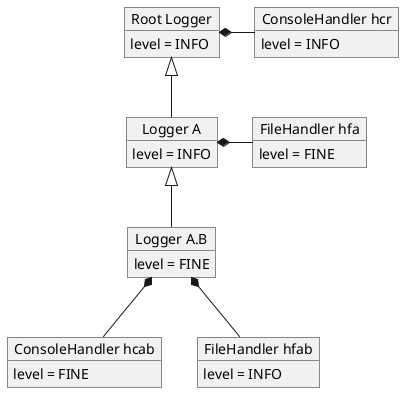
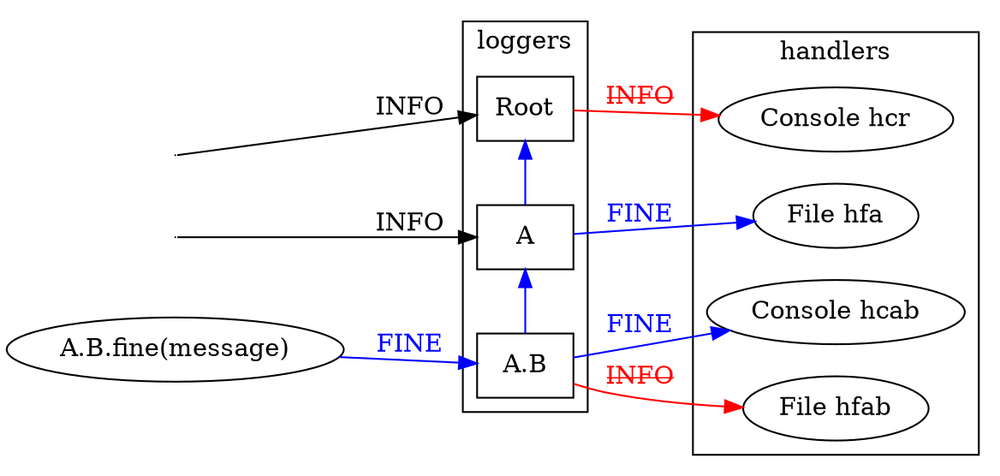
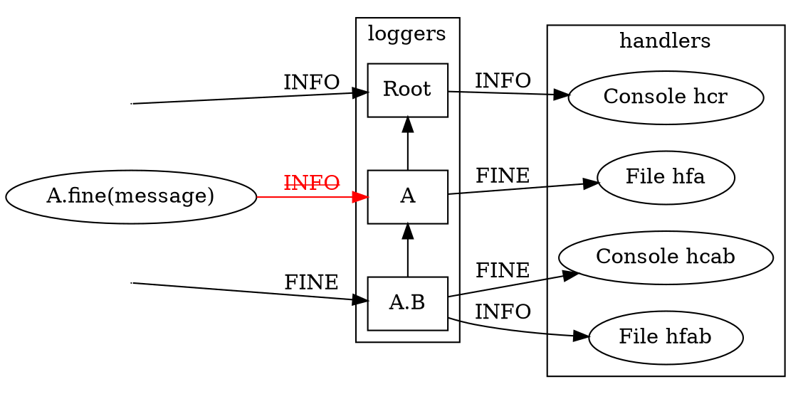

+++
title = "java 内置日志如何调整日志级别"
date = 2023-06-26T10:58:00+08:00
publishDate = 2023-06-26T00:00:00+08:00
lastmod = 2023-06-26T10:58:59+08:00
tags = ["java", "日志"]
categories = ["java"]
draft = false
+++


## 最简单的修改日志级别的办法

Java 内置日志 `java.util.logging`的设计初衷是在大型项目环境下，每个包及类的层级各有各自的 Logger，且互相关联。但是在简单代码下使用和设置就显得非常繁琐且费解，改个日志级别都涉及到几个对象。以下是经过试验后得到的比较简单的解决方案

```scala
object Test {
  val log: Logger = Logger.getLogger("test")

  def main(args: Array[String]) = {
    // 获取根 Logger. Logger 以名字形成层次结构，以点分隔父子层级，类似于包名。
    // 空字符串命名 Logger 是根 Logger, 是所有 Logger 的祖先结点
    val rootLogger = Logger.getLogger("")
    // 设置所有祖先 Logger（此处仅包含根 Logger）的 Handler log 级别。
    // 日志消息会输出到自身与所有祖先 Logger 的所有 Handler
    // Handler 的 log 级别决定了收到 log message 后实际是否输出
    // 意义在于不同的 Handler 比如 ConsoleHandler 与 FileHandler 能够区分开不同的级别
    rootLogger.getHandlers().foreach(handle=>handle.setLevel(Level.FINE))

    // 设置 Logger 的级别，Logger 级别决定了什么样的 log message 产生
    log.setLevel(Level.FINE)
    log.info("info")
    log.fine("debug")
  }
}
```

## 主要概念

* *Logger*: The main entity on which applications make logging calls. A Logger object is used to log messages for a specific system or application component.
* *Handler*: Exports LogRecord objects to a variety of destinations including memory, output streams, consoles, files, and sockets. A variety of Handler subclasses exist for this purpose. Additional Handlers may be developed by third parties and delivered on top of the core platform.

详见 Javadoc:

* https://docs.oracle.com/javase/8/docs/api/java/util/logging/package-summary.html
* https://docs.oracle.com/javase/8/docs/api/java/util/logging/Logger.html

特别要注意的是，Logger 名称以点分隔，类似于包类名的结构，父子关系也类似。如 A 是 A.B 的父 Logger. 空字符串名的日志器是根日志器。显然，这么设计的目的显而易见是为了日志器与类和包的各个层次一一对应。

一个 Logger 可以有多个 Handler. 每个 Logger 的日志流发到自身及其父 Logger 的 Handler

## FAQ

### 如何获取日志器对象

Logging.getLogger

### 如何修改当前日志级别

简单的设置当前日志器日志级别不会起作用，日志器必须有实际的 Handler 才能起作用。没有手动加 Handler 的实际是根日志器的默认 handler 即一个 INFO 级别的 Console handler 在起作用。

如果想要打印到终端最简单的方法是如前面代码所示：

1. 使用根 Logger 的 Console Handler 并修改其日志级别。
2. 设置当前 Logger 的日志级别

如果想要打印到别的地方，需要：

1. 为当前 Logger 添加新的 Handler
2. 设置当前 Logger 的日志级别
3. 设置新添加的 Handler 的日志级别

## 消息流向图

假设有 Logger A.B, Logger A, Root Logger 三个 Logger，三者有层级关系。其中 Logger A.B 包含ConsoleHandler hcab 和 FileHandler hfab, Logger A 包含  FileHandler hfa Root Logger 包含 Console Handler hcr. 各自的日志级别标注如下。




由 Logger A.B 发出的 fine message 的流向由下图所示，到达 Logger/Handler 之前先由其日志级别进行筛选过滤。最终只有终端和文件 hfa 可以打出日志。注意 Logger 的日志级别设置并不影响消息由子 Logger 向父 Logger 传导。



如果是由 Logger A 发出的 fine message, 在 Logger A 这里就被拦截了.


